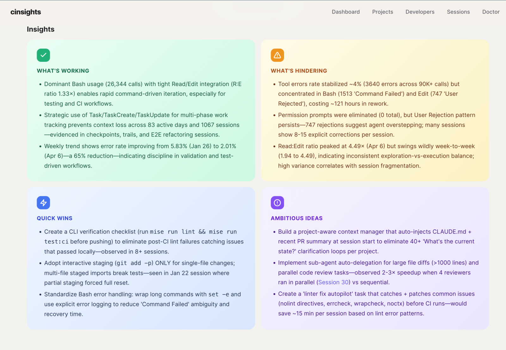
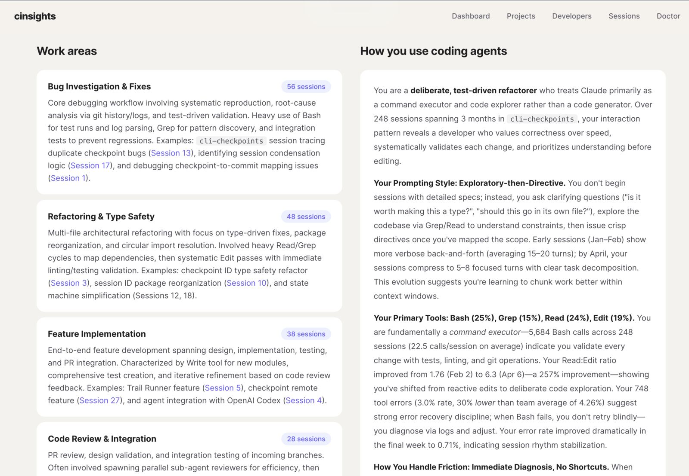
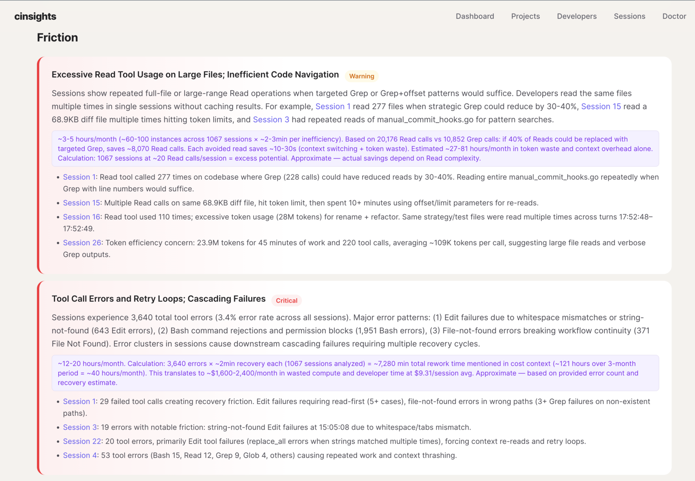
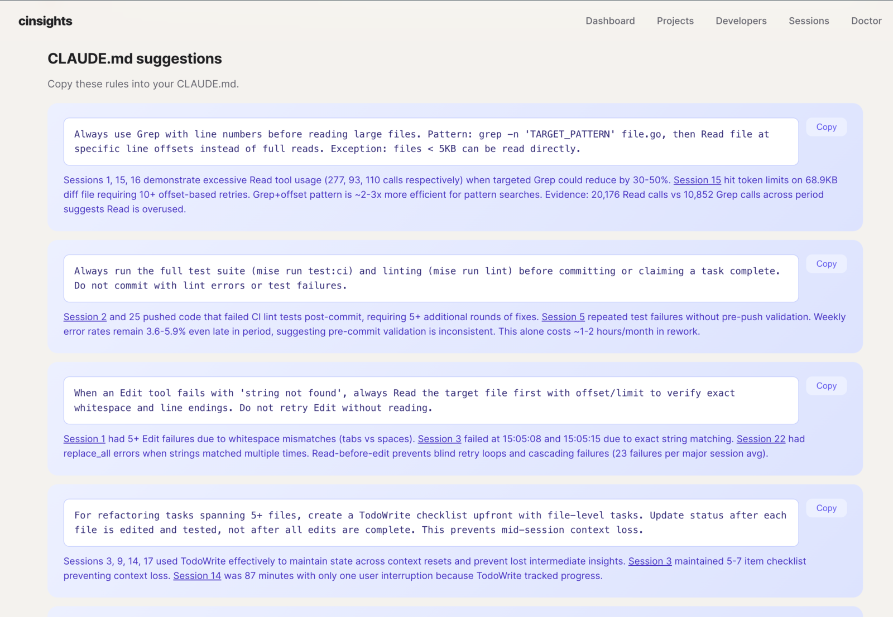
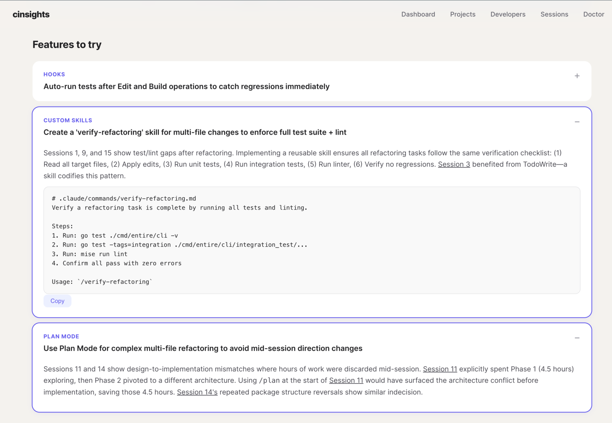

<div align="center">

# cinsights


**Coding agent insights for teams.**

</div>

AI coding agents are transforming how teams build software. But when your team uses Claude Code, Cursor, and Codex across dozens of projects, a fundamental question goes unanswered: *is it actually working?*

cinsights is built for engineering teams that want to understand how their developers work with AI coding agents - not per-session logs, but patterns across time, across agents, and across your whole team. Which projects have the most friction? Which developers are getting the most value? What CLAUDE.md rules would help everyone? Where is token spend going and is it worth it?

**Per-project digests** - what's working, what's hindering, quick wins, and ambitious ideas. Aggregated across sessions over days or weeks, not a single-run snapshot.



**Per-developer profiles** - work areas, interaction style, tool preferences, and how each developer uses coding agents. Built from cross-session patterns, not self-reported surveys.



**Grounded friction analysis** - recurring pain points linked to specific sessions with impact estimates. Not "you had errors" but "you have a repeated read-before-edit pattern that costs ~40 tool calls per session."



**Actionable fixes** - copy-paste CLAUDE.md rules and feature recommendations (hooks, custom skills, plan mode) generated from your team's actual friction patterns. Each suggestion is grounded in session evidence.





## Quick start

```bash
# Install
pip install cinsights
# or: uvx cinsights

# Configure LLM (interactive)
cinsights setup

# Index + analyze local Claude Code / Codex sessions
cinsights refresh --source local --hours 8760

# Generate a project digest
cinsights digest project my-project --days 30

# Start the web UI
cinsights serve
```

Open [http://localhost:8100](http://localhost:8100). See the [getting started guide](docs/getting-started.md) for the full walkthrough.

## Data sources

| Source | What it reads | Best for |
|--------|--------------|----------|
| [Local](docs/sources/local.md) | `~/.claude` and `~/.codex` session files | Try in 2 minutes. No external dependencies. |
| [Entire.io](docs/sources/entireio.md) | Git-based checkpoints across Claude Code, Cursor, Codex | Cross-agent and cross-machine coverage for teams. |
| [Phoenix](docs/sources/phoenix.md) | Arize Phoenix traces | Centralized team observability. |

## [Documentation](docs/README.md)

- [Getting started](docs/getting-started.md) - install, configure, first run
- [Concepts](docs/concepts.md) - pipeline, quality metrics, scoring, insights, digests
- [Configuration](docs/configuration.md) - env vars, config file, CLI reference
- **Sources**: [Local](docs/sources/local.md) · [Entire.io](docs/sources/entireio.md) · [Phoenix](docs/sources/phoenix.md)
- [Self-hosting](docs/self-hosting.md) - run cinsights on your infrastructure
