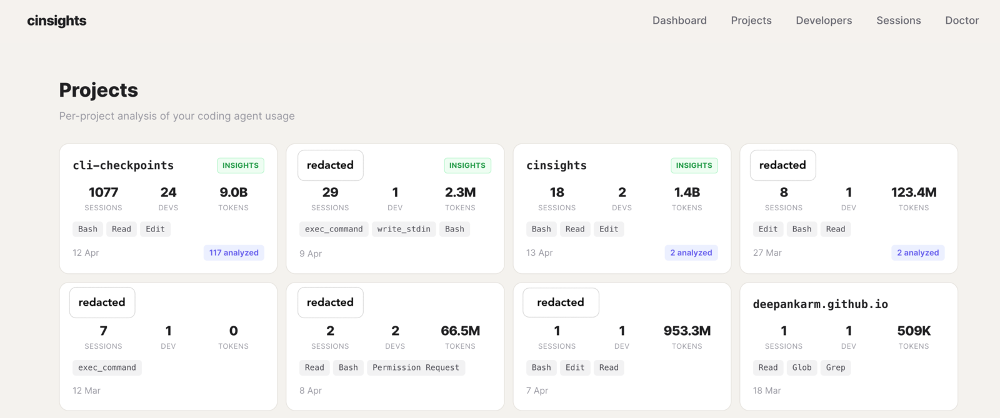

# Getting started

Everything you need to go from zero to your first insights report.

## Prerequisites

- Python 3.11+ (3.12 recommended)
- An LLM provider API key (Anthropic, OpenAI, etc.) — or [Ollama](https://ollama.com) for local inference without an API key

## Install

```bash
pip install cinsights
```

Or with uvx (no install required):

```bash
uvx cinsights
```

## Configure your LLM provider

Interactive setup (prompts for each value):

```bash
cinsights setup
```

Or one-shot:

```bash
cinsights setup --provider anthropic --model claude-haiku-4-5-20251001
```

API keys come from environment variables (`ANTHROPIC_API_KEY`, `OPENAI_API_KEY`, etc.) - they're never stored in the config file.

cinsights uses Haiku by default. A full refresh of 50 sessions costs roughly $0.10-0.30. This is intentional - insights should be cheap enough to run daily.

### Using Ollama (no API key needed)

If you don't have an API key or want to try cinsights without any cloud calls:

```bash
brew install ollama
ollama pull qwen2.5:14b
cinsights setup --provider openai --model qwen2.5:14b --base-url http://localhost:11434/v1
```

Local models are slower than cloud APIs (a digest takes ~2-3 minutes vs seconds) but free and work offline. Use `qwen2.5:14b` for best quality or `qwen2.5:7b` on machines with less RAM.

See [configuration](configuration.md) for the full reference.

## Choose a source

cinsights supports three data sources. Pick one to start:

- **Just want to try it?** Start with [local](sources/local.md). Reads `~/.claude` and `~/.codex` directly. No setup, fastest way to see what cinsights does.
- **Want cross-agent coverage (Claude Code + Cursor + Codex)?** Use [Entire.io](sources/entireio.md). Captures sessions across agents via git.
- **Running Phoenix for your team?** Use [Phoenix](sources/phoenix.md). Centralized observability with per-developer, per-project insights.

## Your first run

Using the local source as an example:

```bash
# Set your API key (skip if using Ollama)
export ANTHROPIC_API_KEY=sk-ant-...

# 1. Index sessions - discovers sessions, computes quality metrics, scores them.
#    Zero LLM cost. (--hours 8760 scans ~1 year of history)
cinsights index --source local --hours 8760

# 2. Analyze - LLM examines scored sessions above the threshold.
cinsights analyze --source local

# 3. Digest - generates a cross-session report for a project.
cinsights digest project my-project --days 30

# 4. Start the web UI
cinsights serve
```

Open [http://localhost:8100](http://localhost:8100).

Or run index + analyze together with `cinsights refresh --source local --hours 8760`, then run digest separately.



## What to look at first

Start with the **digest** - it's the big picture. You'll see what's working, what's friction, and copy-paste CLAUDE.md suggestions.

Then drill into **individual sessions** to see quality metrics and per-session insights. The quality metrics are always free; the insights cost tokens.

## Next steps

- [Concepts](concepts.md) - understand the pipeline, quality metrics, and scoring
- [Configuration](configuration.md) - tune budget modes, limits, and scheduling
- [Source docs](sources/local.md) - deeper setup for your chosen data source

---

<div align="right">

**[Next: Concepts →](./concepts.md)**

</div>
